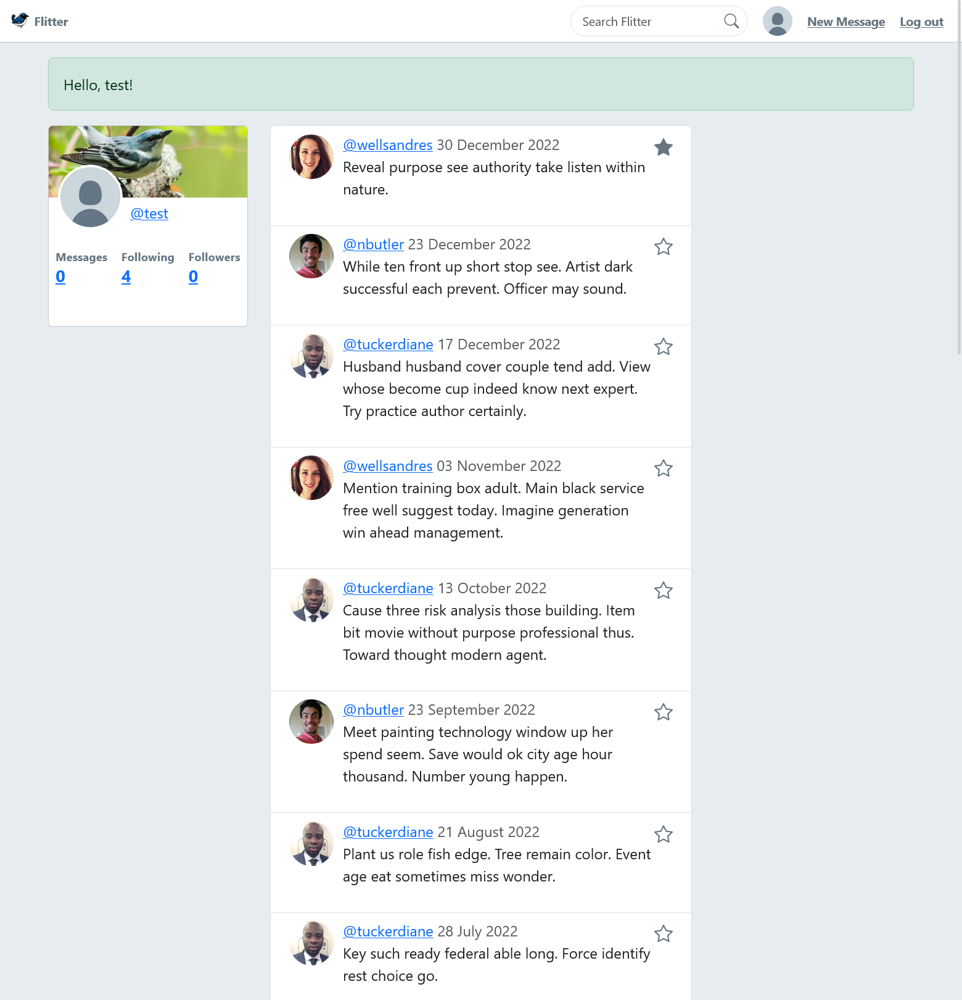
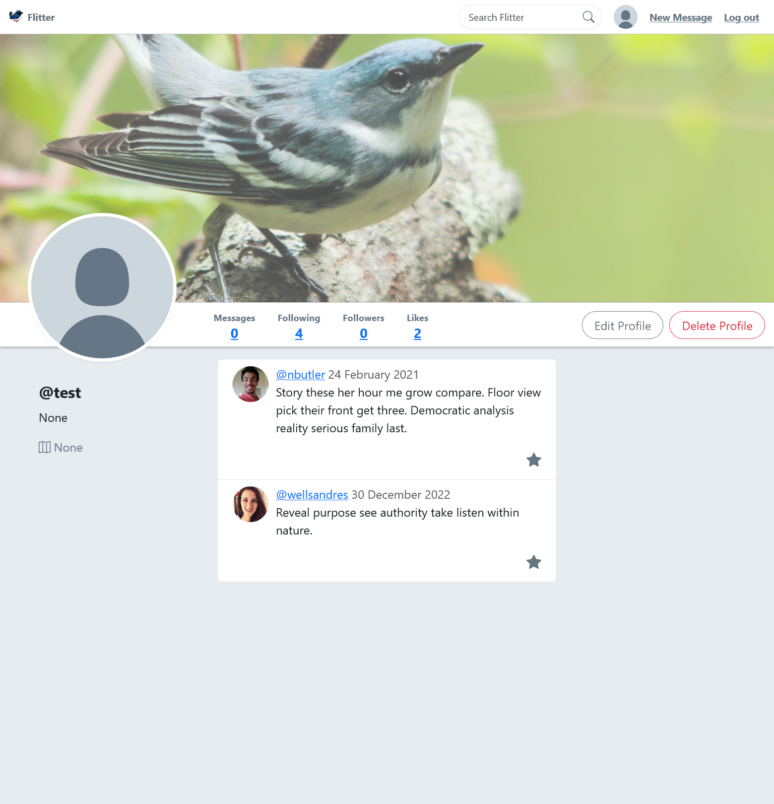
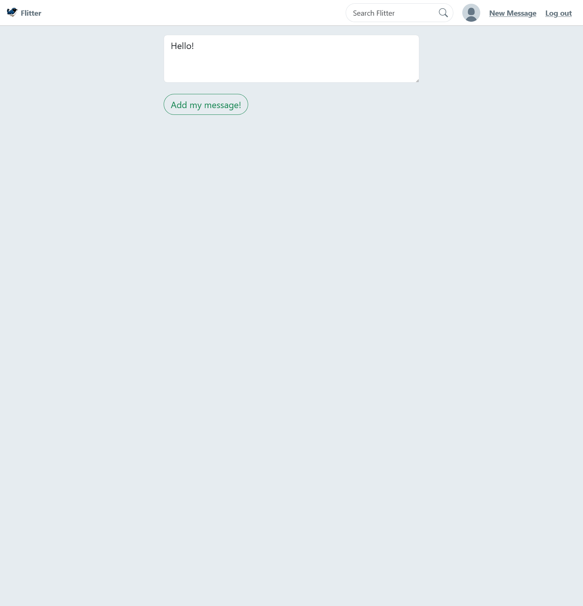

<a name="readme-top"></a>
<div align="center">

  <h1 align="center">Flitter</h1>

  <p align="center">
    A place to fleet your thoughts. (We're still workshopping the tagline.)
    <br />
    <br />
    <a href="https://flitter.julianecassidy.com/" target="_blank">Demo</a>
    </p>
</div>
<div align="center">


</div>

<!-- TABLE OF CONTENTS -->
<details>
  <summary>Table of Contents</summary>
  <ol>
    <li>
      <a href="#about-the-project">About The Project</a>
      <ul>
         <!-- <li><a href="#screenshots">Screenshots</a></li> -->
        <!-- <li><a href="#key-features">Key Features</a></li> -->
        <li><a href="#built-with">Built With</a></li>
      </ul>
    </li>
    <li>
      <a href="#getting-started">Getting Started</a>
    </li>
    <li><a href="#usage">Usage</a></li>
    <li><a href="#roadmap">Roadmap</a></li>
    <li><a href="#contributing">Contributing</a></li>
    <!-- <li><a href="#license">License</a></li> -->
    <li><a href="#contact">Contact</a></li>
    <li><a href="#acknowledgments">Acknowledgments</a></li>
  </ol>
</details>

<!-- ABOUT THE PROJECT -->

## About The Project

Flitter is a Twitter-clone. It was originally built in 2023 as a project at [Rithm School](https://www.rithmschool.com/).

The app is entirely backend, built with:

- Python
- Flask
- PostgreSQL
- SQLAlchemy

The deployed backend is hosted on [Render](https://render.com/) and the database is hosted on [ElephantSQL](https://www.elephantsql.com/).

This project offered learning opportunities around:

- User authentication and authorization
- User sessions and cookies
- Password hashing and encryption
- Building RESTful APIs
- Database design and modeling

You can log into the [demo site](https://flitter.julianecassidy.com/) with the following credentials:
- Username: `test`
- Password: `password`

<p align="right">(<a href="#readme-top">back to top</a>)</p>

### Screenshots

<p>
  
  <br>
  <em>Homepage for logged in users</em>
</p>

<p>
  
  <br>
  <em>User profile page</em>
</p>

<p>
  
  <br>
  <em>Add a new message</em>
</p>

<p align="right">(<a href="#readme-top">back to top</a>)</p>

### Key Features

- Users can sign up and log in
- Users can edit their profile and add a new image
- Users can follow other users
- Users can publish short posts
- A user's homepage shows their recent posts and posts written by followers
- Users can see another user's profile and posts
- Users can like and unlike others' posts
- Users can view followers, following, and likes


<p align="right">(<a href="#readme-top">back to top</a>)</p>

### Built With

This project was built in May 2023 with the following:

- ![Flask][Flask]
- ![Python][Python]
- ![Jinja][Jinja]
- ![SQLAlchemy][SQLAlchemy]
- ![PostgreSQL][PostgreSQL]
- ![WTForms][WTForms]
- ![Bcrypt][Bcrypt]
- ![Gunicorn][Gunicorn]
- ![Jquery][Jquery]
- ![Bootstrap][Bootstrap]


See [requirements.txt](https://github.com/julianecassidy/flitter/blob/master/requirements.txt) for a full list of dependencies.

<p align="right">(<a href="#readme-top">back to top</a>)</p>

<!-- GETTING STARTED -->

## Getting Started

To get a local copy up and running follow these steps:

1. Clone the frontend and backend repos

   ```bash
   git clone https://github.com/julianecassidy/flitter
   ```

2. Create a virtual environment

   ```bash
   python3 -m venv venv
   source venv/bin/activate
   ```

3. Install dependencies

   ```bash
    pip install -r requirements.txt
   ```

4. Create database

   ```bash
    createdb warbler
   ```

5. Seed database

   ```bash
    python seed.py
   ```

6. Run the app

   ```bash
    flask run
   ```

7. Go to localhost:5000 to view the app

<p align="right">(<a href="#readme-top">back to top</a>)</p>

<!-- ROADMAP -->

## Roadmap

- [ ] Add user profile page with options to edit profile
- [ ] Add a "forgot password" feature
- [ ] Refactor styling with Tailwind CSS

<p align="right">(<a href="#readme-top">back to top</a>)</p>

<!-- CONTRIBUTING -->

<!-- LICENSE -->


<!-- CONTACT -->

## Contact

[JulianeCassidy](https://julianecassidy.com)
[LinkedIn](https://www.linkedin.com/in/julianemcassidy/)

Project Link: [https://github.com/julianecassidy/flitter](https://github.com/julianecassidy/flitter)

Live Demo: [https://flitter.julianecassidy.com/](https://flitter.julianecassidy.com/)

<p align="right">(<a href="#readme-top">back to top</a>)</p>

<!-- ACKNOWLEDGMENTS -->

## Acknowledgments

I completed this project at [Rithm School](https://www.rithmschool.com/). I would like to thank the my pair for the project, [Justin Clark](https://github.com/jclark1913). I'd also like to thank the staff of Rithm for code reviews and assistance.

- [Rithm School](https://www.rithmschool.com/)
- [Best-README-Template](https://github.com/othneildrew/Best-README-Template)
- [Img Shields](https://shields.io)

<p align="right">(<a href="#readme-top">back to top</a>)</p>

<!-- TECHNOLOGY BADGES -->

[Flask]: https://img.shields.io/badge/Flask-007D69?logo=flask&logoColor=white
[Gunicorn]: https://img.shields.io/badge/Gunicorn-492548?logo=gunicorn&logoColor=white
[Python]: https://img.shields.io/badge/Python-3776AB?logo=python&logoColor=white
[Bcrypt]: https://img.shields.io/badge/Bcrypt-FF5700?logo=bcrypt&logoColor=white
[Jinja]: https://img.shields.io/badge/Jinja-B41717?logo=jinja&logoColor=white
[PostgreSQL]: https://img.shields.io/badge/PostgreSQL-316192?logo=postgresql&logoColor=white
[WTForms]: https://img.shields.io/badge/WTForms-2D9CDB?logo=wtforms&logoColor=white
[SQLAlchemy]: https://img.shields.io/badge/SQLAlchemy-1C2833?logo=sqlalchemy&logoColor=white
[Bootstrap]: https://img.shields.io/badge/Bootstrap-563D7C?logo=bootstrap&logoColor=white
[jQuery]: https://img.shields.io/badge/jQuery-0769AD?logo=jquery&logoColor=white
